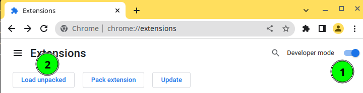

# ChatGpt Prompts 🤖

一个 chat-gpt 的 chrome 插件，用来帮助用户存储、收集一些调教 gpt 的语料，自动插入到 [chat 页面](https://chat.openai.com/chat/) 的输入框。

## 功能

- 文本自动填充到 [chat 页面](https://chat.openai.com/chat/) 的输入框

- 添加自定义的 prompts
- 自动抓取、导入 [🧠ChatGPT 中文调教指南](https://github.com/PlexPt/awesome-chatgpt-prompts-zh) 数据

## 安装

1. 下载最新的包 `.crx` 并解压
2. 打开 `chrome://extensions`
3. 开启开发者模式
4. 点击 `Load unpacked` 上传压缩包

## 感谢

- https://github.com/elwin013/vitaly-extension
- https://github.com/PlexPt/awesome-chatgpt-prompts-zh

## License

[MIT](LICENSE)
